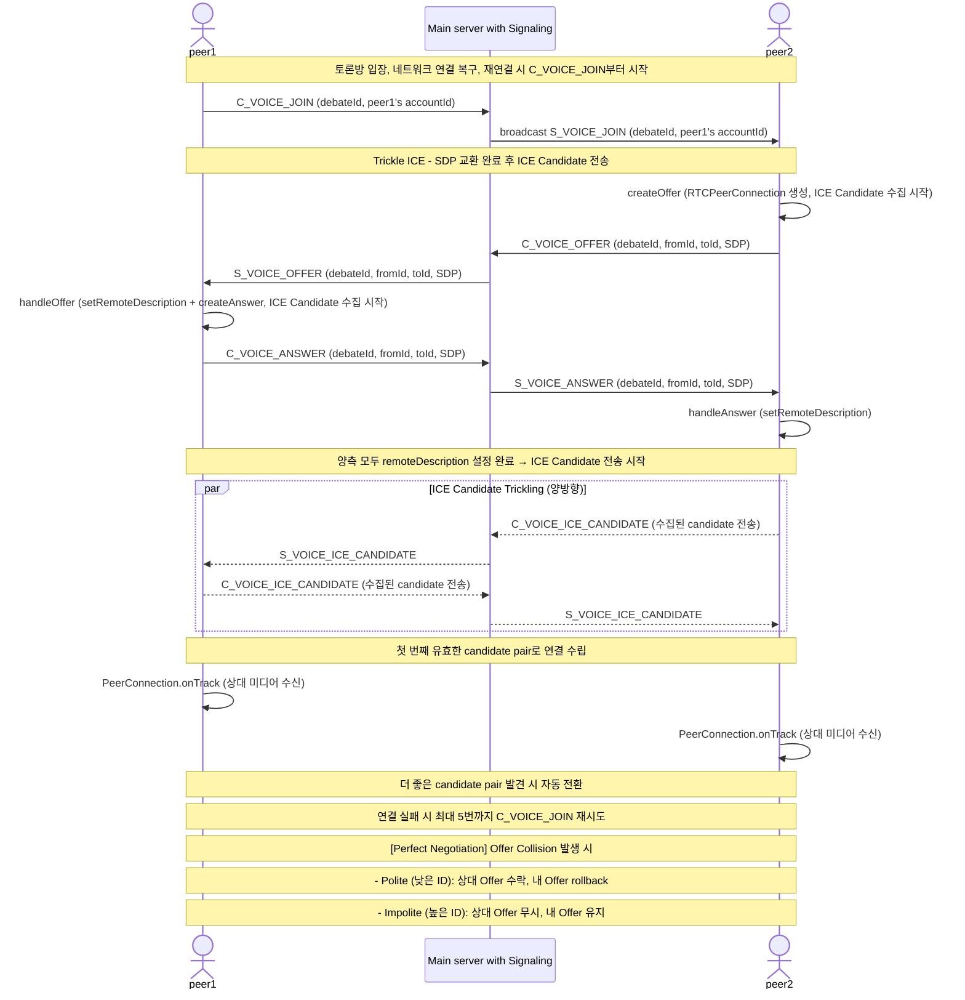

# Book Talk

책을 주제로 사용자들이 토론하고 발표하는 실시간 커뮤니케이션 플랫폼

---

## 주요 플로우

### voice chat flow

```mermaid
sequenceDiagram
    actor p1 as peer1
    participant s as Main server with Signaling
    actor p2 as peer2

    note over p1, p2: 토론방 입장, 네트워크 연결 복구, 재연결 시 C_VOICE_JOIN부터 시작
    p1->>s: C_VOICE_JOIN (debateId, peer1's accountId)
    s->>p2: broadcast S_VOICE_JOIN (debateId, peer1's accountId)

    note over p1, p2: Trickle ICE - SDP 교환 완료 후 ICE Candidate 전송

    p2->>p2: createOffer (RTCPeerConnection 생성, ICE Candidate 수집 시작)
    p2->>s: C_VOICE_OFFER (debateId, fromId, toId, SDP)
    s->>p1: S_VOICE_OFFER (debateId, fromId, toId, SDP)

    p1->>p1: handleOffer (setRemoteDescription + createAnswer, ICE Candidate 수집 시작)
    p1->>s: C_VOICE_ANSWER (debateId, fromId, toId, SDP)
    s->>p2: S_VOICE_ANSWER (debateId, fromId, toId, SDP)
    p2->>p2: handleAnswer (setRemoteDescription)

    note over p1, p2: 양측 모두 remoteDescription 설정 완료 → ICE Candidate 전송 시작

    par ICE Candidate Trickling (양방향)
        p2-->>s: C_VOICE_ICE_CANDIDATE (수집된 candidate 전송)
        s-->>p1: S_VOICE_ICE_CANDIDATE
        p1-->>s: C_VOICE_ICE_CANDIDATE (수집된 candidate 전송)
        s-->>p2: S_VOICE_ICE_CANDIDATE
    end

    note over p1, p2: 첫 번째 유효한 candidate pair로 연결 수립
    p1->>p1: PeerConnection.onTrack (상대 미디어 수신)
    p2->>p2: PeerConnection.onTrack (상대 미디어 수신)

    note over p1, p2: 더 좋은 candidate pair 발견 시 자동 전환
    note over p1, p2: 연결 실패 시 최대 5번까지 C_VOICE_JOIN 재시도

    note over p1, p2: [Perfect Negotiation] Offer Collision 발생 시
    note over p1, p2: - Polite (낮은 ID): 상대 Offer 수락, 내 Offer rollback
    note over p1, p2: - Impolite (높은 ID): 상대 Offer 무시, 내 Offer 유지
```