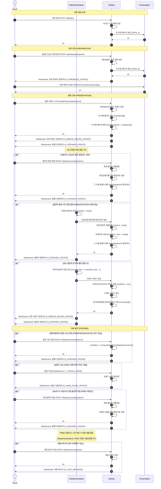

# Book Talk

책을 주제로 사용자들이 토론하고 발표하는 실시간 커뮤니케이션 플랫폼

---

## 프로덕션 배포

### 사전 준비

**필수:**

- Docker & Docker Compose
- Nginx
- Node.js 18+ & npm

**도메인:**

- `booktalk.my` → 서버 IP
- `server.booktalk.my` → 서버 IP

---

## 배포 절차

### 1. 백엔드 배포

#### 초기 배포 (DB 포함)

```bash
cd book-talk-be
./.bin/deployInitProd.sh
```

> `.env.prod` 파일이 설정되어 있어야 합니다.

#### 백엔드만 재배포

```bash
cd book-talk-be
./bin/redeployOnlyBackend.sh
```

> DB와 Redis는 유지하고 백엔드 코드만 재배포합니다.

### 2. 프론트엔드 배포

```bash
cd book-talk-fe
./bin/deployProd.sh
```

> `.env.production` 파일이 설정되어 있어야 합니다.

---

## 기술 스택

**프론트엔드:** React 19, TypeScript, Vite 7, Material-UI
**백엔드:** Kotlin 2.0, Spring Boot 3.5.4, PostgreSQL 16, Redis 7
**인프라:** Nginx, Docker, Let's Encrypt

---

## 주요 플로우

### 토론 시스템 시퀀스 다이어그램



### 주요 특징

#### 서버 주도 아키텍처

- **DebateScheduler**: 1초마다 실행되어 발표자 시간 만료를 자동으로 감지하고 처리
- **자동 진행**: PRESENTATION 라운드에서 발표자 시간이 끝나면 자동으로 다음 발표자로 전환
- **실시간 동기화**: 모든 상태 변경은 WebSocket을 통해 실시간으로 모든 클라이언트에게 브로드캐스트

#### 토론 라운드 타입

- **PREPARATION**: 토론 준비 단계 (발표 자료 작성)
- **PRESENTATION**: 순차적 발표 단계 (자동 진행)
- **FREE**: 자유 토론 단계 (수동 진행, 손들기 기능 활용)
