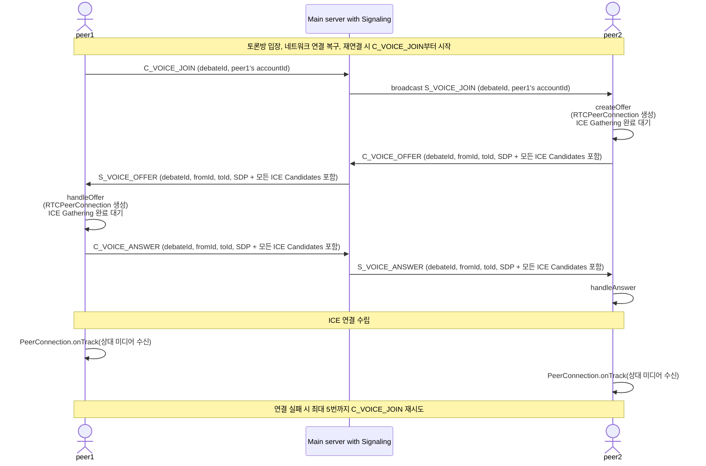

# Book Talk

책을 주제로 사용자들이 토론하고 발표하는 실시간 커뮤니케이션 플랫폼

---

## 프로덕션 배포

### 사전 준비

**도메인:**

- `booktalk.my` → 서버 IP
- `server.booktalk.my` → 서버 IP
- `ai.server.booktalk.my` → 서버 IP

---

## 배포 절차

### 1. 백엔드 배포

#### 초기 배포 (DB 포함)

```bash
cd book-talk-be
./.bin/deployInitProd.sh
```

> `.env.prod` 파일이 설정되어 있어야 합니다.

#### 백엔드만 재배포

```bash
cd book-talk-be
./.bin/redeployOnlyBackend.sh
```

> DB와 Redis는 유지하고 백엔드 코드만 재배포합니다.

### 2. 프론트엔드 배포

```bash
cd book-talk-ts
./.bin/web/deployProd.sh
```

> `packages/web/.env.production` 파일이 설정되어 있어야 합니다.

### 3. AI 서버 배포

```bash
cd book-talk-ts
./.bin/ai/deployProd.sh
```

> `packages/ai/.env.production` 파일이 설정되어 있어야 합니다.

**Docker 명령어:**

```bash
# 로그 보기
docker compose -f packages/ai/docker-compose.yml logs -f

# 상태 확인
docker compose -f packages/ai/docker-compose.yml ps

# 중지
docker compose -f packages/ai/docker-compose.yml down
```

### 4. Nginx 설정 적용

```bash
cd deploy
./.bin/applyNginx.sh
```

---

## 주요 플로우

### voice chat flow

